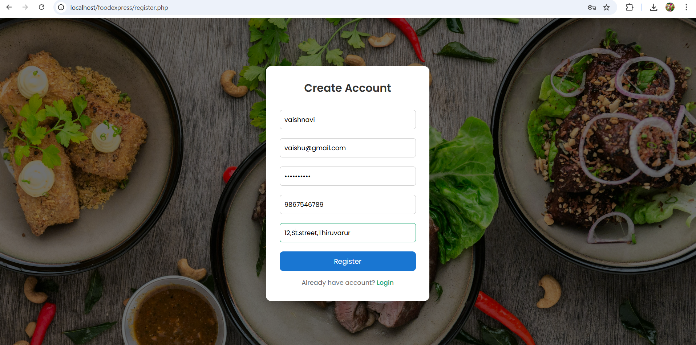
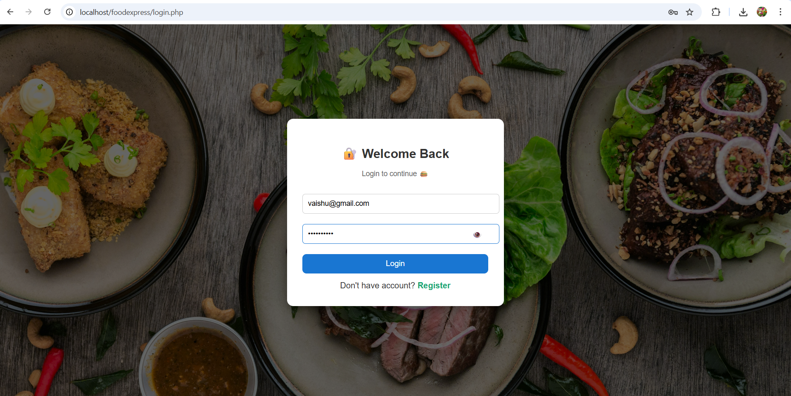
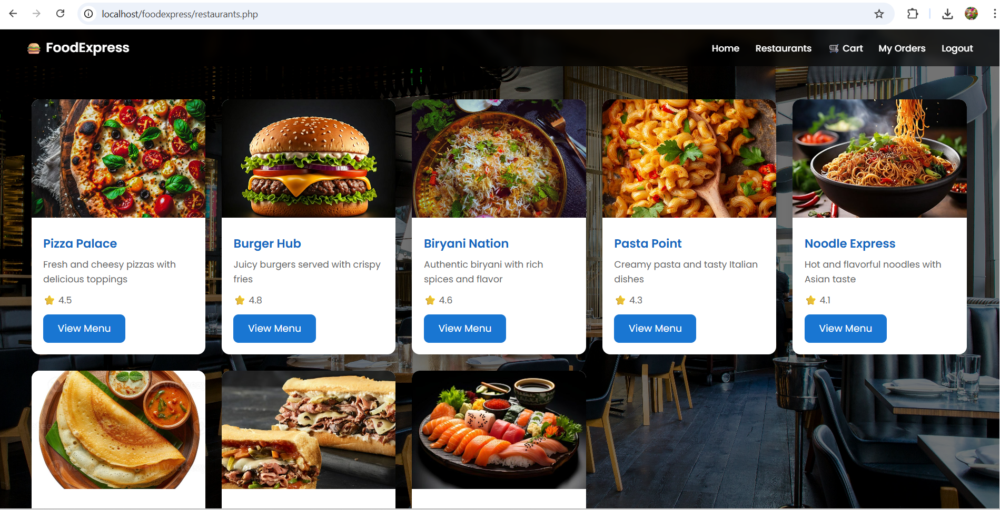
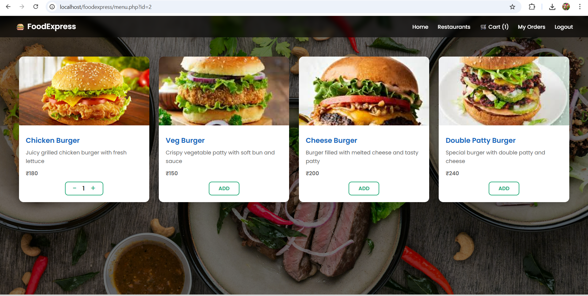
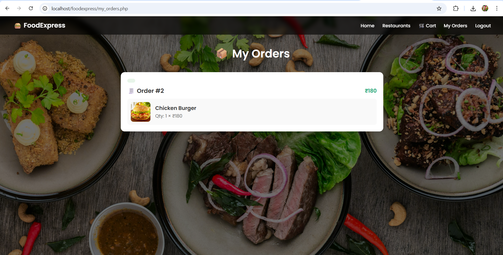
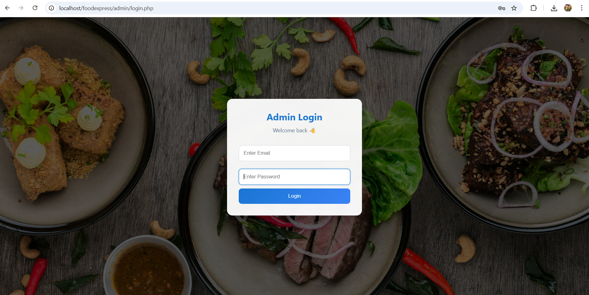

# FoodExpress
FoodExpress is a full-stack online food delivery web application developed using HTML, CSS, JavaScript, PHP, and MySQL.

## Live Demo
https://foodexpress.rf.gd/

## Technologies Used
- HTML
- CSS
- JavaScript
- PHP
- MySQL
- XAMPP

## Project Overview

### User Module
- Users can register and log in to the application
- View available restaurants
- Select a restaurant to view menu items
- Add food items to cart
- Place orders from the cart
- View order history in "My Orders"
- Logout functionality

### Admin Module
- Admin login system
- Dashboard with overview
- Manage restaurants
- Manage food items
- View and manage orders
- Manage users
- Logout functionality

## Database

Database Name: foodexpress

Tables:
- users  
- restaurants  
- foods  
- orders  
- order_items  
- admins

  
## Features
- User authentication (Register/Login)
- Restaurant browsing
- Add to cart functionality
- Order placement system
- Order history tracking
- Admin panel for management

  
## 📸 Project Flow Screenshots

### 1. Home Page

###  2. User Register

###  3. User Login

###  4. Browse Restaurants

### 5. View Menu

###  6. Place Order

###  7. Order Success

###  8. My Orders

###  9. User Home

##  Admin Flow

###  1. Admin Login

###  2. Admin Dashboard

###  3. Manage Orders

###  4. Manage Foods

###  5. Manage Restaurants

###  6. Manage Users

## Conclusion
FoodExpress is a complete online food ordering system with both user and admin functionalities. 
The application demonstrates full-stack development using PHP and MySQL with a structured database design.
